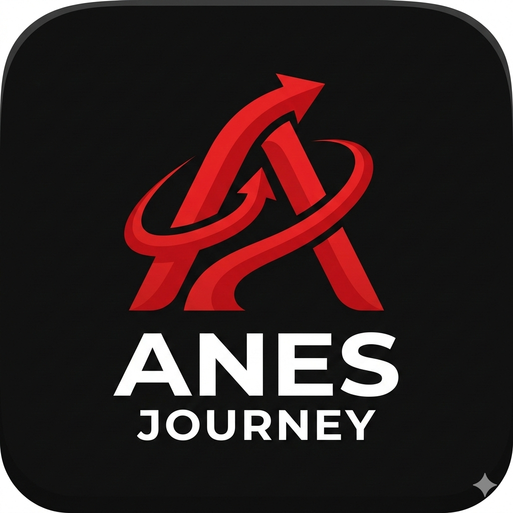

<p align="center">
  
</p>

<h1 align="center">Anes Journey</h1>

<p align="center">
  <strong>A comprehensive life tracking and personal development companion.</strong>
</p>

<p align="center">
  <a href="https://flutter.dev">
    
  </a>
  <a href="https://dart.dev">
    
  </a>
</p>

---

## 🌟 Overview

**Anes Journey** is a beautifully crafted, all-in-one personal productivity and tracking mobile application. Designed to organize your daily life efficiently, it helps you stay focused on what truly matters: your goals, habits, responsibilities, and spiritual routines.

The application brings together multiple facets of personal development into a single, intuitive, and modern interface. Whether you're tracking daily prayers, building lasting habits, organizing study sessions, or managing goals, **Anes Journey** is designed to be your core companion.

## ✨ Key Features

- **📊 Comprehensive Dashboard**: Get an overview of your day, your tasks, your progress, and quickly access essential tools right from the home screen.
- **📅 Interactive Calendar**: Visualize your schedule, upcoming events, and track milestones chronologically.
- **✅ To-Do & Task Management**: Keep track of pending tasks, set priorities, and stay on top of your responsibilities with ease.
- **🎯 Dynamic Trackers**:
  - **Prayers**: Log and track your daily spiritual routines.
  - **Goals**: Set and monitor Weekly, Monthly, and Yearly goals to keep your long-term vision in check.
  - **Habits**: Build and sustain positive behaviors over time.
- **📖 Personal Journal**: A private space for reflection, logging your thoughts, and tracking your mood day-by-day.
- **🌍 Language Study Logger**: Built-in specialized tools (e.g., German Ausbildung tracking) to track and maintain consistency with your study sessions.
- **📤 Data Export**: easily export your data locally into JSON format to ensure you never lose your progress.
- **🌙 Premium Dark Theme**: A sleek, modern user interface, designed around deep dark tones and vibrant neon accents for a stunning visual experience.

## 🚀 Getting Started

To get a local copy up and running, follow these simple steps.

### Prerequisites

You need to have the Flutter SDK installed on your system.
1. [Install Flutter](https://docs.flutter.dev/get-started/install)

### Installation

1. Clone the repository:
   ```bash
   git clone https://github.com/anesdevv/anes-journey.git
   ```
2. Navigate to the project directory:
   ```bash
   cd anes-journey
   ```
3. Install dependencies:
   ```bash
   flutter pub get
   ```
4. Run the app:
   ```bash
   flutter run
   ```

## 🛠️ Built With

* [Flutter](https://flutter.dev/) - Framework
* [Dart](https://dart.dev/) - Programming Language
* [Firebase](https://firebase.google.com/) - Backend & Authentication

## 📱 Screenshots

*(Screenshots coming soon...)*

## 🤝 Contributing

Contributions, issues, and feature requests are welcome!

## 📜 License

This project is open-source.
